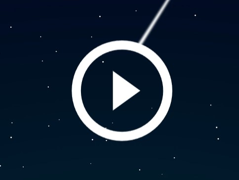
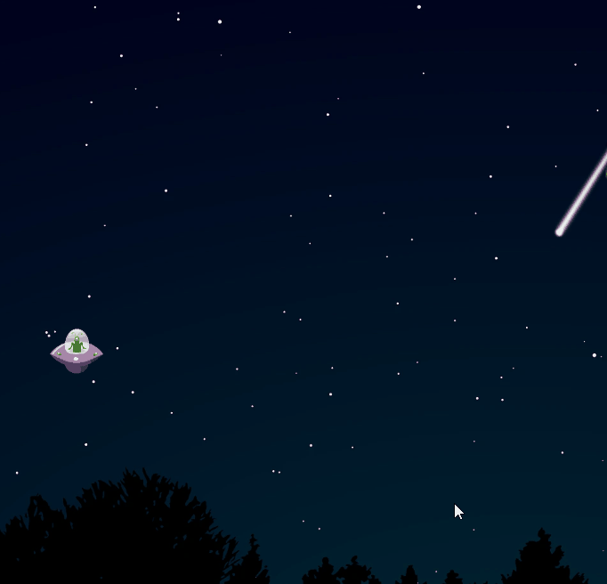
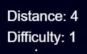
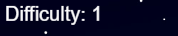
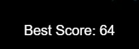
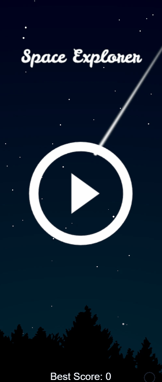
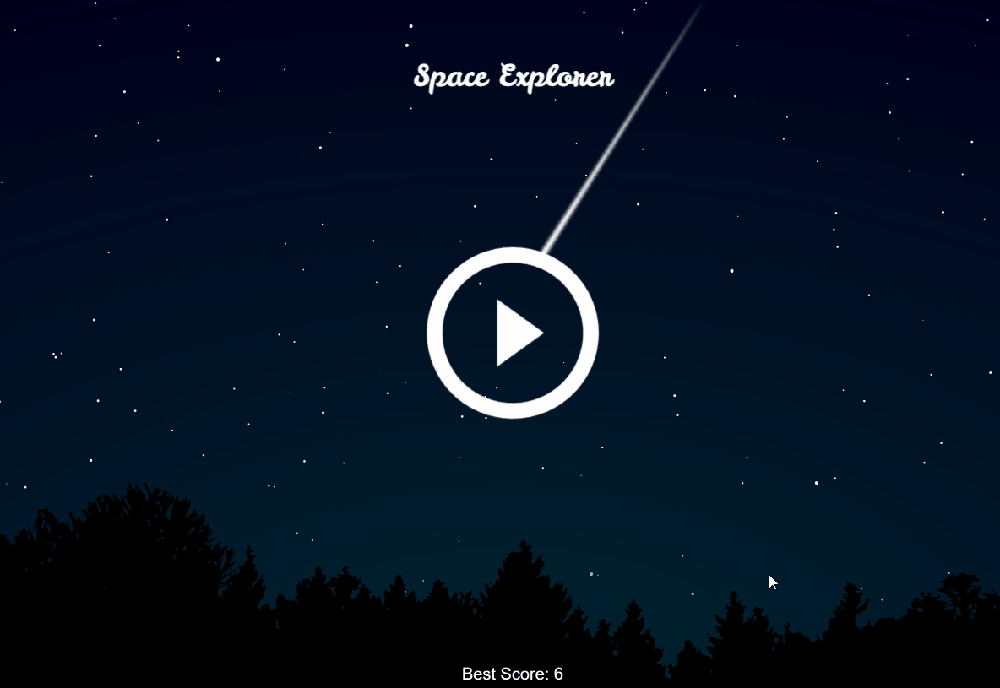
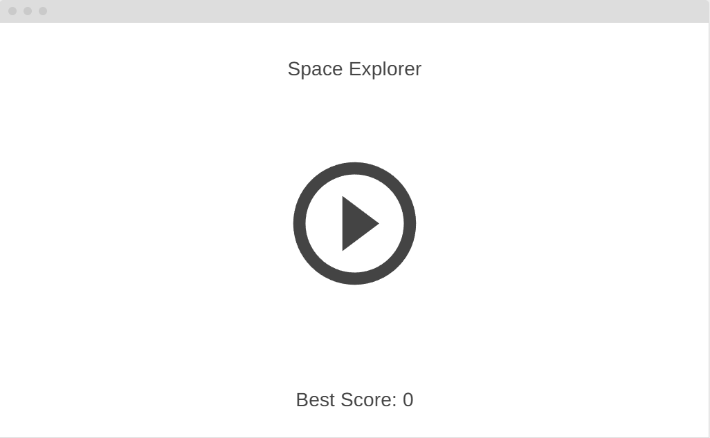
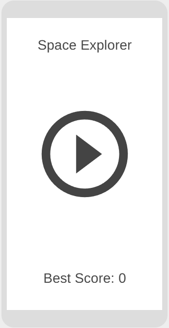

# Space Explorer
Space Explorer is a fun skill and reaction based game that takes place in space. You must control the spaceship to travel as far as possible while avoiding asteroids and planets.

The live page can be viewed here: [Link to Space Explorer](https://paulmarren.github.io/space-explorer/ "Link to the live website")

# Table of Contents
- [Space Explorer](#space-explorer)
- [Table of Contents](#table-of-contents)
  - [UX](#ux)
    - [User stories](#user-stories)
    - [Design](#design)
    - [Wireframes](#wireframes)
  - [Technologies](#technologies)  

## UX

### User stories
1. **As a new player, I want to understand how to start the game so that I can begin playing immediately.**
   - The game displays a clear start button when the page loads, making it easy for new players to start the game.
   
   
2. **As a player, I want to control the spaceship easily and consistently so that I can navigate through obstacles.**
   - The spaceship can be controlled by holding the mouse button (or tapping on mobile) to lift the spaceship and releasing it to let it fall.

   
3. **As a player, I want to see my score and the difficulty level so that I can track my progress.**
   - The game displays the current score and difficulty level in the top-left corner of the screen.

   
4. **As a player, I want the game to increase in difficulty over time so that I am challenged as I play.**
   - The game increases the number of asteroids every 10 seconds, making it progressively harder to avoid collisions.

   
5. **As a player, I want to see my highest score so that I can try to beat it in future games.**
   - The game displays the highest score achieved during the session, encouraging players to improve their performance.

   
6. **As a mobile player, I want the game to work seamlessly on my device so that I can enjoy the game on the go.**
   - The game supports touch events, allowing mobile players to control the spaceship by tapping the screen.

   
7. **As a player, I want the game to restart quickly after losing so that I can try again without delay.**
   - The game resets immediately after a collision, allowing players to start a new game with a single click or tap.

   

### Design
1. **Visual Design**
   - **Title Image and Start Button**: The game features a visually appealing title image and a start button centered on the screen. These elements are designed to be intuitive and welcoming for new players.
   - **Spaceship and Asteroids**: The spaceship and asteroid images are simple yet visually distinct, making it easy for players to differentiate between them during gameplay.
   - **Score and Difficulty Display**: The score and difficulty level are displayed in a clean, readable font at the top of the screen, ensuring players can quickly access this information.

2. **Game Mechanics**
   - **Spaceship Control**: The spaceship is controlled by holding the mouse button (or tapping on mobile) to lift it and releasing to let it fall. This mechanic is easy to understand and provides a satisfying sense of control.
   - **Obstacle Generation**: Asteroids are generated dynamically, with their positions randomized to create a unique challenge in each game. The number of asteroids increases over time, ensuring the game remains challenging.
   - **Collision Detection**: The game checks for collisions between the spaceship and asteroids, as well as with the top and bottom of the screen. This ensures fair gameplay and clear feedback when the game ends.

3. **Difficulty Progression**
   - The number of asteroids increases every 10 seconds. This gradual increase in difficulty keeps players engaged and motivated to improve their skills.

4. **Responsive Design**
   - The game canvas resizes dynamically to fit the screen size, ensuring a consistent experience across different devices. Touch events are supported for mobile players, making the game accessible on smartphones and tablets.

5. **User Feedback**
   - The game provides immediate feedback when the player loses, resetting the game quickly so players can try again. The highest score is displayed to encourage players to beat their previous record.

### Wireframes
**Desktop**
 

**Mobile**
 

## Technologies
### Languages used
  - HTML5
  - CSS3
  - JavaScript
### Frameworks, Libraries & Programs Used
   1. Git
      - Git was used for version control by utilizing the Visual Studio Code terminal to commit to Git and Push to GitHub.
   2. GitHub
      - GitHub is used to store the projects code after being pushed from Git and to deploy the website.
   3. Visual Studio Code
      - Visual Studio Code was used as the IDE.
