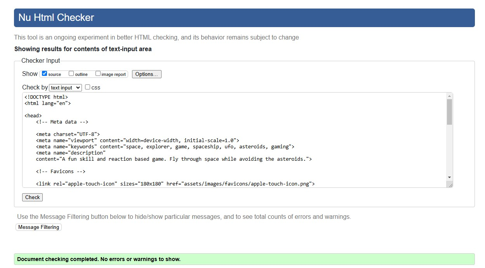
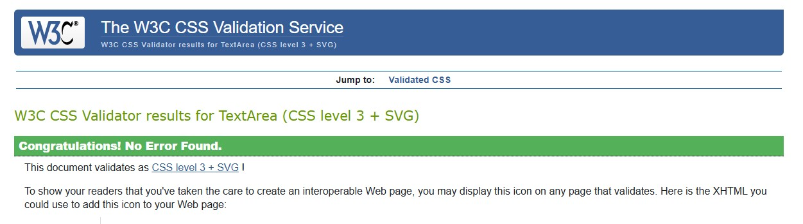
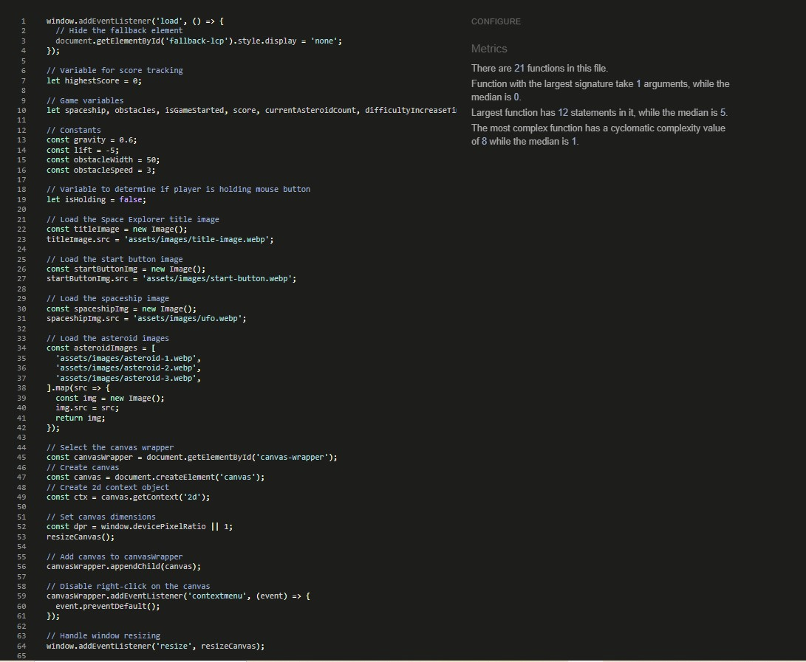
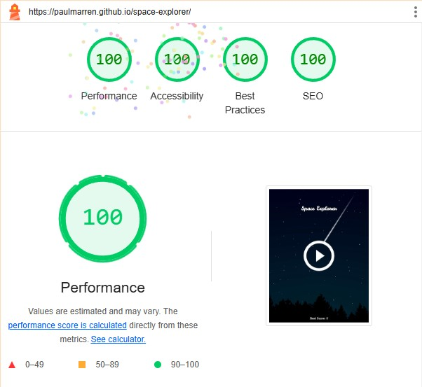
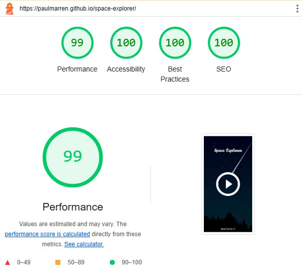
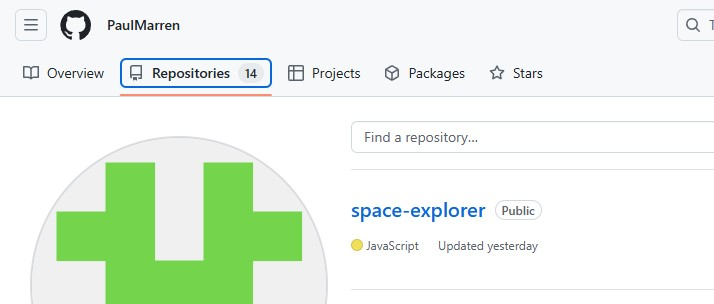
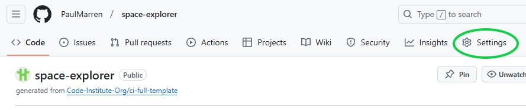
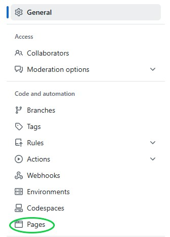
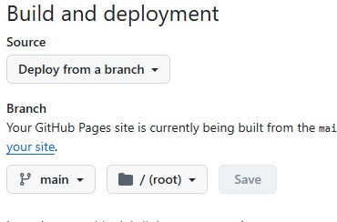
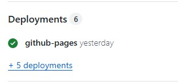

# Space Explorer
Space Explorer is a fun skill and reaction based game that takes place in space. You must control the spaceship to travel as far as possible while avoiding asteroids and planets.

The live page can be viewed here: [Link to Space Explorer](https://paulmarren.github.io/space-explorer/ "Link to the live website")

# Table of Contents
- [**USER EXPERIENCE**](#-user-experience)
- [**TECHNOLOGIES**](#-technologies)
- [**TESTING**](#-testing)
- [**BUGS**](#-bugs) 
- [**USED PLATFORMS AND DEVICES**](#-used-platforms-and-devices) 
- [**DEPLOYMENT**](#-deployment)
- [**CREDITS**](#-credits)  

## 🎨 User Experience  

### <ins>User Stories</ins>

  
<strong>📜 User Stories (Click to expand)</strong>

   

  1. **As a new player, I want to understand how to start the game so that I can begin playing immediately.**  
  
  2. **As a player, I want to control the spaceship easily and consistently so that I can navigate through obstacles.**  

  3. **As a player, I want to see my score and the difficulty level so that I can track my progress.**  

  4. **As a player, I want the game to increase in difficulty over time so that I am challenged as I play.**  

  5. **As a player, I want to see my highest score so that I can try to beat it in future games.**  

  6. **As a mobile player, I want the game to work seamlessly on my device so that I can enjoy the game on the go.**  
    
  7. **As a player, I want the game to restart quickly after losing so that I can try again without delay.**  
    

### <ins>Design</ins>

  
<strong>🎨 Visual Design (Click to expand)</strong>

   

  - **Title Image and Start Button**:  
    The game features a visually appealing title image and a start button centered on the screen. These elements are designed to be intuitive and welcoming for new players.  
  - **Spaceship and Asteroids**:  
    The spaceship and asteroid images are simple yet visually distinct, making it easy for players to differentiate between them during gameplay.  
  - **Score and Difficulty Display**:  
    The score and difficulty level are displayed in a clean, readable font at the top of the screen, ensuring players can quickly access this information.  

  
<strong>🕹️ Game Mechanics (Click to expand)</strong>

   

  - **Spaceship Control**:  
    The spaceship is controlled by holding the mouse button (or tapping on mobile) to lift it and releasing to let it fall. This mechanic is easy to understand and provides a satisfying sense of control.  
  - **Obstacle Generation**:  
    Asteroids are generated dynamically, with their positions randomized to create a unique challenge in each game. The number of asteroids increases over time, ensuring the game remains challenging.  
  - **Collision Detection**:  
    The game checks for collisions between the spaceship and asteroids, as well as with the top and bottom of the screen. This ensures fair gameplay and clear feedback when the game ends.  

  
<strong>📈 Difficulty Progression (Click to expand)</strong>

   

  The number of asteroids increases every 10 seconds. This gradual increase in difficulty keeps players engaged and motivated to improve their skills.  

  
<strong>📱 Responsive Design (Click to expand)</strong>

   

  The game canvas resizes dynamically to fit the screen size, ensuring a consistent experience across different devices. Touch events are supported for mobile players, making the game accessible on smartphones and tablets.  

  
<strong>💡 User Feedback (Click to expand)</strong>

   

  The game provides immediate feedback when the player loses, resetting the game quickly so players can try again. The highest score is displayed to encourage players to beat their previous record.  

### <ins>Wireframes</ins>

  
<strong>📱 Mobile (Click to reveal)</strong>

   

  
<strong>🖥️ Desktop (Click to reveal)</strong>

   

## 🛠️ Technologies  

  
<strong>🖥️ Languages Used (Click to expand)</strong>

   

  - **HTML5**
  - **CSS3**
  - **JavaScript**

  
<strong>📚 Frameworks, Libraries & Programs Used (Click to expand)</strong>

   

  1. **Git**  
     - Git was used for version control by utilizing the Visual Studio Code terminal to commit to Git and Push to GitHub.  
  2. **GitHub**  
     - GitHub is used to store the projects code after being pushed from Git and to deploy the website.  
  3. **Visual Studio Code**  
     - Visual Studio Code was used as the IDE.  

## 🧪 Testing  
### <ins>Testing User Stories</ins>

  
<strong>🎮 1. New Player: Understand how to start the game (Click to expand)</strong>

   
  
  - The game displays a clear start button when the page loads, making it easy for new players to start the game.
  
  

  
<strong>🚀 2. Player: Control the spaceship easily (Click to expand)</strong>

   
  
  - The spaceship can be controlled by holding the mouse button (or tapping on mobile) to lift the spaceship and releasing it to let it fall.
  
  

  
<strong>📊 3. Player: Track score and difficulty (Click to expand)</strong>

   
  
  - The game displays the current score and difficulty level in the top-left corner of the screen.
  
  

  
<strong>💪 4. Player: Increasing difficulty (Click to expand)</strong>

   
  
  - The game increases the number of asteroids every 10 seconds, making it progressively harder to avoid collisions.
  
  

  
<strong>🏆 5. Player: View highest score (Click to expand)</strong>

   
  
  - The game displays the highest score achieved during the session, encouraging players to improve their performance.
  
  

  
<strong>📱 6. Mobile Player: Seamless mobile experience (Click to expand)</strong>

   
  
  - The game supports touch events, allowing mobile players to control the spaceship by tapping the screen.
  
  

  
<strong>🔁 7. Player: Quick restart after losing (Click to expand)</strong>

   
  
  - The game resets immediately after a collision, allowing players to start a new game with a single click or tap.
  
  

### <ins>Testing Principles</ins>
For Space Explorer, I used manual testing as the primary approach due to the project's scope and time constraints.

  
<strong>👨‍💻 Manual Testing (Click to expand)</strong>

   
  
  Manual testing was ideal for:
  
  - Validating game mechanics (e.g., collision detection, scoring)
  - Testing user interactions (mouse/touch controls)
  - Identifying visual/UX issues (e.g., canvas rendering, responsive design)
  
  It allowed for ad-hoc exploration of edge cases (e.g., rapid clicks, screen resizing).
  
  Deployment methods:
  - Playtesting by myself to catch bugs and ensure game works as expected
  - Cross-device testing (mobile/desktop) to ensure responsiveness

  
<strong>🤖 Automated Testing (Click to expand)</strong>

   
  
  While automated testing (e.g., Jest) would be valuable for continuous testing as I developed my project, it was not feasible here due to:
  
  - Time constraints in setting up test suites for a small-scale game
  - The heavy reliance on canvas rendering and real-time interactions, which are harder to automate effectively
  
  Future Considerations:
  - In a production environment, I'd integrate tests for core logic (e.g., score calculations)

### <ins>Manual Testing</ins>

  
<strong>🚀 Starting the game (Click to expand)</strong>

   

**Testing Method**

- Desktop: Click the start button image using a mouse.

- Mobile: Tap the start button image using a touchscreen device.

**Expected Result**

- The game should start immediately after clicking or tapping the start button.

- The spaceship should appear on the screen, and asteroids should begin to generate and move across the canvas.

- The score and difficulty level should be displayed in the top-left corner.

**Actual Result**

- The game started as expected on both desktop and mobile devices.

- The spaceship appeared, and asteroids began to generate and move.

- The score and difficulty level were displayed correctly.

  
<strong>🎮 Spaceship Controls (Click to expand)</strong>

   

**Testing Method**

- Desktop: Hold down the mouse button to lift the spaceship and release it to let it fall.

- Mobile: Tap and hold the screen to lift the spaceship and release to let it fall.

**Expected Result**

- The spaceship should move upward when the mouse button is held down (or the screen is tapped and held on mobile).

- The spaceship should tilt upward slightly while lifting.

- The spaceship should fall when the mouse button is released (or the tap ends on mobile).

**Actual Result**

- The spaceship moved upward and tilted as expected when the mouse button was held down or the screen was tapped.

- The spaceship fell when the mouse button was released or the tap ended.

  
<strong>💎 Obstacle Generation (Click to expand)</strong>

   

**Testing Method**

- Play the game for several minutes and observe the asteroid generation.

**Expected Result**

- Asteroids should generate dynamically and move across the screen from right to left.

- The number of asteroids should increase every 10 seconds as the difficulty level increases.

**Actual Result**

- Asteroids generated dynamically and moved across the screen as expected.

- The number of asteroids increased every 10 seconds, and the difficulty level was displayed correctly.

  
<strong>💥 Collision Detection (Click to expand)</strong>

   

**Testing Method**

- Intentionally collide the spaceship with an asteroid.

- Intentionally collide the spaceship with the top or bottom of the canvas.

**Expected Result**

- The game should end immediately upon collision.

- The game should reset, displaying the start button and title image.

**Actual Result**

- The game ended immediately upon collision with an asteroid or the canvas boundaries.

- The game reset correctly, displaying the start button and title image.

  
<strong>📊 Score and Difficulty Tracking (Click to expand)</strong>

   

**Testing Method**

- Play the game and observe the score and difficulty level.

**Expected Result**

- The score should increase as the spaceship travels further.

- The difficulty level should increase every 10 seconds.

**Actual Result**

- The score increased as expected, and the difficulty level increased every 10 seconds.

  
<strong>🏆 Highest Score Tracking (Click to expand)</strong>

   

**Testing Method**

- Play the game multiple times, achieving different scores.

**Expected Result**

- The highest score should be updated and displayed correctly after each game.

**Actual Result**

- The highest score was updated and displayed correctly after each game.

  
<strong>📱 Responsiveness (Click to expand)</strong>

   

**Known Issue: Page Refresh Required in Chrome DevTools**

When testing the game's responsiveness using Chrome DevTools, the canvas may not resize dynamically unless the page is refreshed. This occurs because the resize event is not always triggered correctly in Responsive Design Mode, even though the event listener is properly implemented in the code.

**Steps to Test Responsiveness**
1. Open the game in Chrome and launch DevTools (F12).

2. Switch to the Responsive Design Mode.

3. Select a device or manually adjust the screen size.

4. Refresh the page after changing the screen size to ensure the canvas resizes correctly.

**Verify that**

- The canvas fits the new screen size.

- All game elements (spaceship, asteroids, score, etc.) are visible and functional.

- The game remains playable on the new screen size.

**Expected Result**
- After refreshing the page, the canvas should resize to fit the new screen size.

- All game elements should adjust accordingly, and the game should remain fully functional.

**Actual Result**
- The canvas resized correctly after refreshing the page.

- All game elements adjusted as expected, and the game remained playable on all tested screen sizes.

**Workaround**

To ensure the canvas resizes correctly during testing:

- Manually refresh the page after changing the screen size in Chrome DevTools.

- Alternatively, test responsiveness on actual devices.

  
<strong>🔄 Game Reset (Click to expand)</strong>

   

**Testing Method**

- Collide the spaceship with an asteroid or the canvas boundaries to end the game.

**Expected Result**

- The game should reset immediately, displaying the start button and title image.

**Actual Result**

- The game reset as expected, allowing players to start a new game immediately.

 
<strong>✅ Summary of Manual Testing (Click to expand)</strong>

   

  - All test cases were executed successfully, and the game behaved as expected. No major issues were found during manual testing.

### <ins>Validator Testing</ins>

  
<strong>📄 HTML Validator (Click to expand)</strong>

   
  
  The W3C Markup Validator was used to validate index html page and ensure there was no errors.
  
  

  
<strong>🎨 CSS Validator (Click to expand)</strong>

   
  
  The W3C CSS Validator Service was used to validate the CSS stylesheet and ensure there was no errors.
  
  

  
<strong>🛠️ JavaScript Validator (Click to expand)</strong>

   
  
  The JavaScript Validator (https://jshint.com/) was used to check the scripts.js file for any errors.
  
  

### <ins>Lighthouse Testing</ins>

 Lighthouse testing was used to determine the site's performance, accessibility, best practices and SEO. Special emphasis was layed on performance and accessibility to provide a great user experience for every visitor, no matter the device or conditions.

  
<strong>🖥️ Desktop Results</strong>

   
  
  

  
<strong>📱 Mobile Results</strong>

   
  
  

## 🐛 Bugs

  
<strong>❌ Unfixed bugs</strong>

   
  
  **Page Refresh Required in Chrome DevTools**
  
  When testing the game's responsiveness using Chrome DevTools, the canvas may not resize dynamically unless the page is refreshed. This occurs because the resize event is not always triggered correctly in Responsive Design Mode, even though the event listener is properly implemented in the code.

  
<strong>✅ Fixed bugs</strong>

   
  
  **Touchstart and Mousedown event being triggered simultaneously in Chrome DevTools**
  
  When testing the game's while at smaller screen sizes using Chrome DevTools, the Mousedown event and Touchstart event was being triggered simultaneously when clicking the canvas causing the spaceship to lift twice. 
  
  I solved this by creating a single method to handle the when the canvas is clicked on via mousedown or touchstart. The method uses prevents the default behaviour of the event and ensures only one event is processed at a time.
  
  **Unable to get a lighthouse reading**
  
  When trying to test my website using lighthouse testing i was unable to get a result because my website had no elements as everything is displayed in a canvas. 
  
  I solved this by adding a fallback element of the title image which is then hidden when the canvas is loaded.

## 💻 Used platforms and devices

  
<strong>🌐 Browsers</strong>

   
  
  - Google Chrome
  - Microsoft Edge
  - Mozilla Firefox

  
<strong>📱 Smartphones</strong>

   
  
  - Oppo Reno 4z 5G

## 🚀 Deployment

  
<strong>GitHub Pages</strong>

   
  
  The project was deployed to GitHub Pages using the following steps...
  
  1. **Log in to GitHub and locate the GitHub Repository.**  
     
  
  2. **At the top of the Repository, locate the "Settings" Button on the menu.**  
     
  
  3. **Scroll down the Settings page until you locate the "GitHub Pages" Section.**  
     
  
  4. **Under "Source", click the dropdown called "None" and select "main".**  
     
  
  5. **Scroll back down through the page to locate the now published site link in the "GitHub Pages" section.**  
     

## 🙏 Credits

  
<strong>🛠️ Tools</strong>

   
  
  ### [Polotno Studio](https://studio.polotno.com/)
  * Used to create title image and start button icon.
  
  ### [Techsini](https://techsini.com/multi-mockup/index.php)
  * Used to create the mockup in the readme file.
  
  ### [HTML validator](https://validator.w3.org/)
  * Used to verify HTML code.
  
  ### [CSS validator](https://jigsaw.w3.org/css-validator/)
  * Used to verify CSS code.
  
  ### [JavaScript validator](https://jshint.com/)
  * Used to verify JavaScript code.
  
  ### [Image Resizer](https://imageresizer.com/)
  * Used to resize images.
  
  ### [Favicon Generator](https://favicon.io/)
  * Used to create favicons.

  
<strong>🖼️ Images</strong>

   
  
  * [Spaceship image](https://pixabay.com/vectors/aliens-spaceship-rocket-ship-moon-36912/)
  * [Asteroid 1 image](https://pixabay.com/vectors/asteroid-blast-cosmos-astronomy-8464820/)
  * [Asteroid 2 image](https://pixabay.com/illustrations/planetarium-comet-falling-star-5636947/)
  * [Asteroid 3 image](https://pixabay.com/vectors/eris-planet-terrestrial-satellite-8236210/)
  * [Background image](https://creazilla.com/media/vector/7869965/shooting-star)

