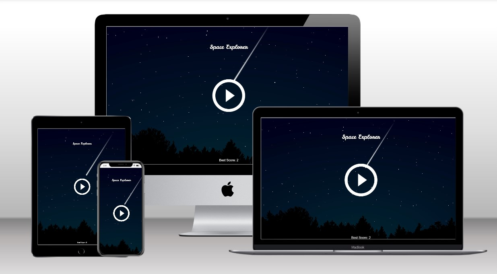

# Space Explorer
Space Explorer is a fun skill and reaction based game that takes place in space. You must control the spaceship to travel as far as possible while avoiding asteroids and planets.

The live page can be viewed here: [Link to Space Explorer](https://paulmarren.github.io/space-explorer/ "Link to the live website")

